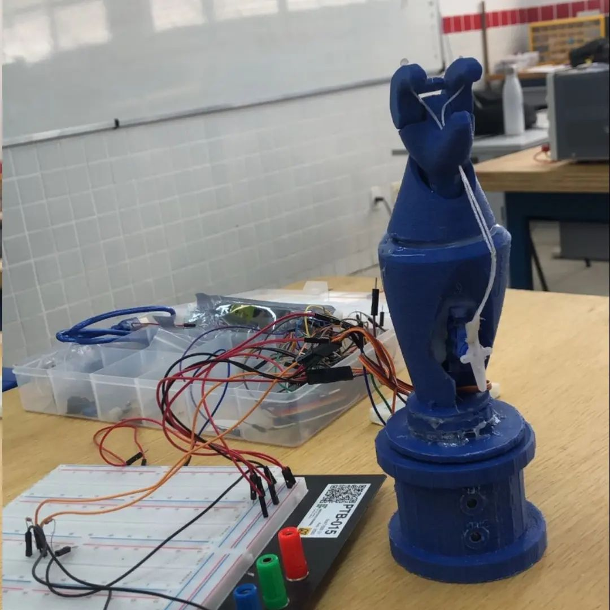
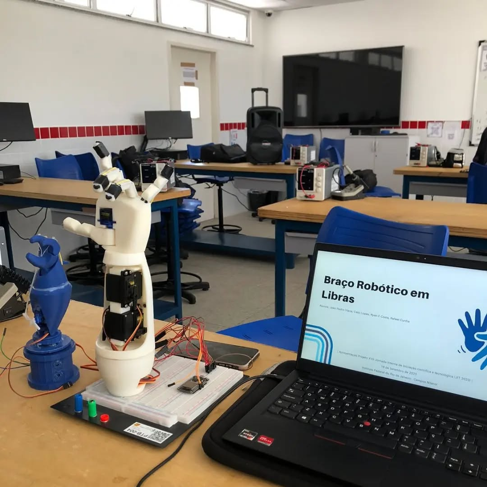
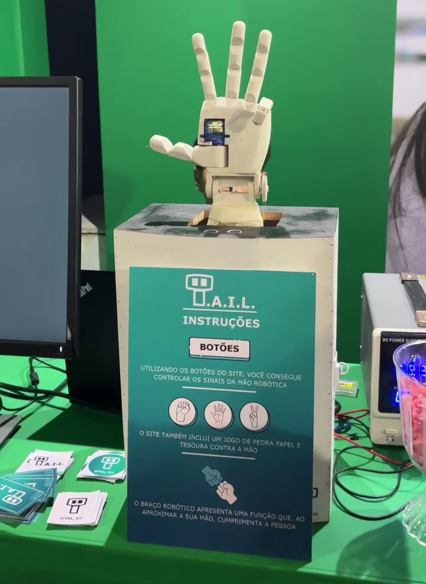
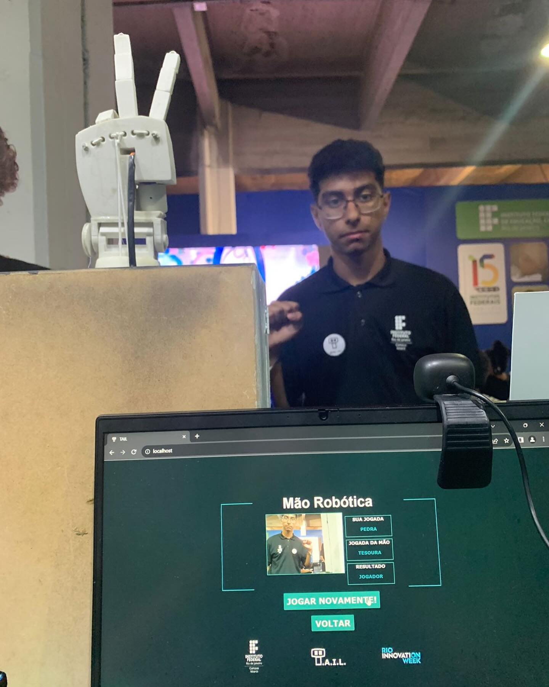
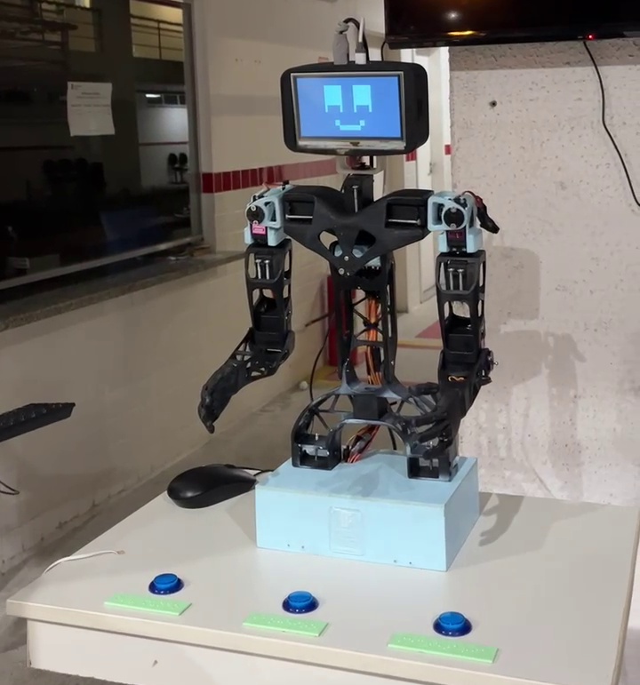
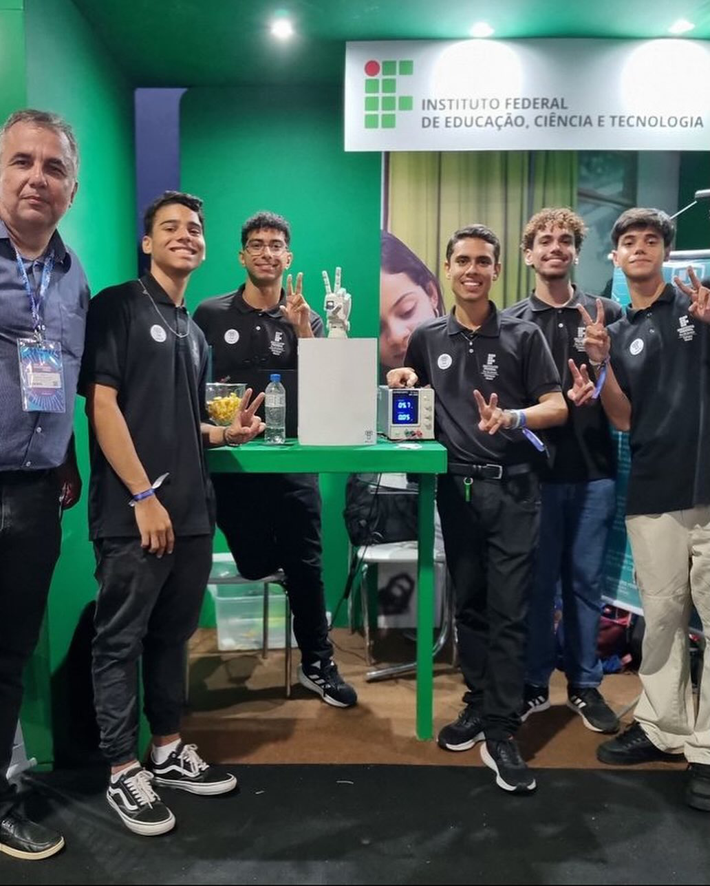

# TAIL TCC - Braço Robótico

[@tail_tcc](https://www.instagram.com/tail_tcc)

O Totem de Acessibilidade e Informação em Libras é um trabalho de conclusão de curso do curso técnico integrado de informática do IFRJ campus Niterói.

TAIL tem o objetivo de auxiliar os educadores no ensino de crianças e jovens nas escolas sobre o ensino da linguagem de sinais (libras), fazendo uso extremo da robótica com micro servos e impressão 3D.

Feito pelos estudantes [João Pedro Viana](https://www.instagram.com/joao.vianas), [Cauã Lopes Pinto](https://www.instagram.com/caua_lp10), [ Caio Lopes Bragança](https://www.instagram.com/qcaiolopes), [Rafael Cunha Siqueira](https://www.instagram.com/rafaelcuns) e [Ryan Ferreira Costa](https://www.instagram.com/ryanfcosta).

### Linguagens utilizadas no decorrer do projeto:

- Python
- JavaScript
- Micropython
- C++

Ele está divido em protótipos de acordo com as mundanças e necessidades do projeto, como apontado a seguir:

## Protótipo 1

Uma simples garrinha para simular a abertura e o fechamento de uma mão com uma base giratória para o pulso. Foi utilizada para mostrar um site que é capaz de mandar a garra executar diferentes movimentos e como promessa para novas implementações.

### Tecnologias:

- Microcontrolador ESP32

## Protótipo 2

Um braço robótico feito de material ABS, que por meio de um website, é responsável por ativar os servos motores presentes no braço, desempenhando sinais específicos,englobando a representação de letras, números e expressões. Além disso, possui uma inteligência artificial que é capaz de capturar determinados movimentos humanos e replicá-los.

### Tecnologias:

- Microcontrolador ESP32
- Microcontrolador ESP32-CAM
- Computador com Python para reconhecimento de gestos

## Protótipo Rio Innovation Week

  
  

Apresentação de um modelo novo de braço robótico que traz diversas experiências divertidas e principalmente acessíveis para pessoas com deficiência auditiva. Estivemos presentes nos estandes da área do MEC dos campi IFRJ.

## Projeto Final

Um totem estrategicamente posicionado em locais como centros culturais, museus e shoppings. Com uma interface intuitiva composta por botões pré-programados e descrições em braille, o TAIL estabelece uma nova abordagem para fornecer informações vitais. Ao pressionar um botão, o robô integrado oferece informações em LIBRAS e áudio, demonstrando uma integração exemplar entre tecnologia e acessibilidade

### Tecnologias:

- Raspberry PI 4
- Arduino Mega
- Zero Delay board

## Nossa equipe

